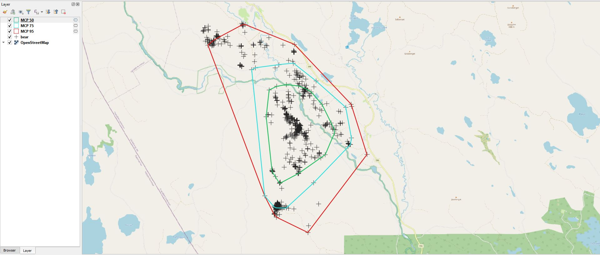
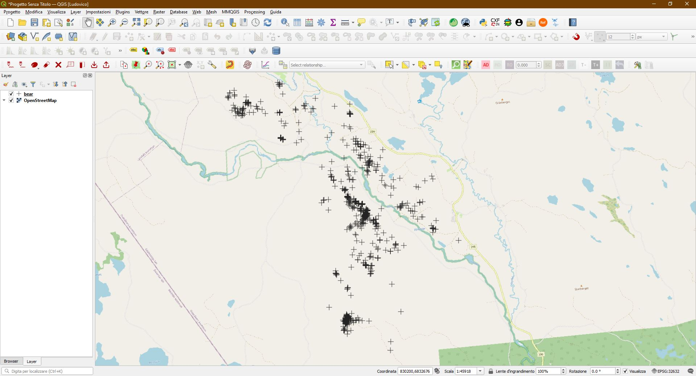
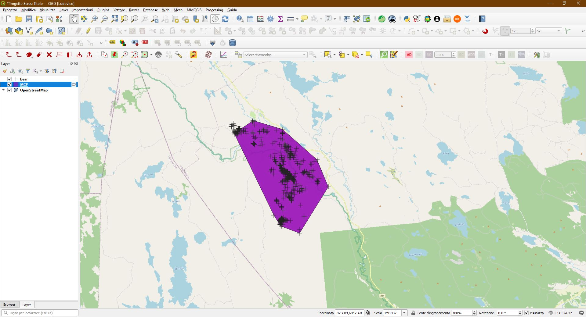
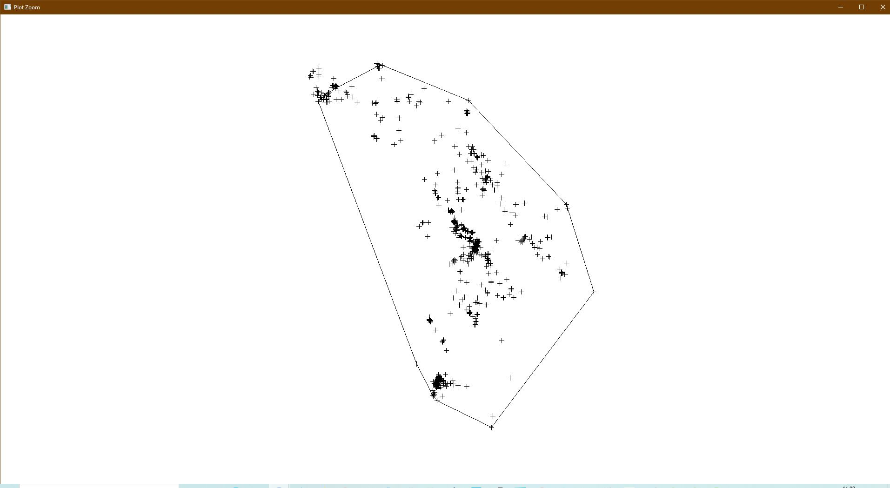
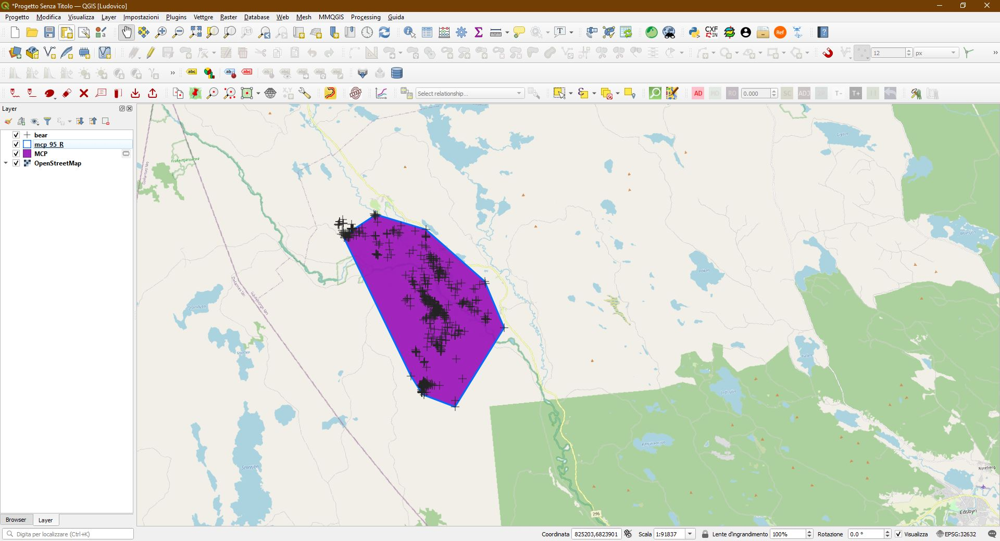

# Home-range-analysis-Minimum-Convex-Polygon-MCP-QGIS




## Description
The model was created with the Graphical Model Builder in QGIS 3.16/3.22 and it allows to calculate the home range for a given percentage through the Minimum Convex Polygon (MCP).

## Usage
- A vector containing the points in a projected Reference System (i.e. UTM).
- A field containing unique id values.
- Percent: a single number for the MCP calculation.

The model uses QGIS algorithms and works only for QGIS 3.16 (and later versions).

In order to use the model, download the model [Home Range MCP.model3](https://raw.githubusercontent.com/ludovico85/Home-range-analysis-Minimum-Convex-Polygon-MCP-QGIS/main/Home%20Range%20MCP.model3) first, then open QGIS, go to the `Processing options`, and select `Open an existing model...` Navigate to the folder containing the model and DONE!

## Example
The data used in this example derive from the [adehabitatHR R package](https://cran.r-project.org/web/packages/adehabitatHR/index.html) and it contains the relocations of one female brown bear monitored using GPS collars during May 2004 in Sweden.



Simply launch the Home Range MCP QGIS model. **The input poiny layer must have an unique id field containing unique values.**



To test the validity of the model, I used the `mcp function` of the adehabitatHR R package with the same dataset.

``` R
library(adehabitatHR)
library(rgdal)

data(bear)
xy <- SpatialPoints(na.omit(ld(bear)[,1:2]))
plot(xy)
mcp <- mcp(xy, percent=95)
```


Then I exported the mcp polygon from R to QGIS.
``` R
writeOGR(mcp, dsn = "I:\\", layer = "mcp_95_R", driver="ESRI Shapefile")
```
Result.



## References
- https://cran.r-project.org/web/packages/adehabitatHR/index.html
- https://mgritts.github.io/2016/04/02/homerange-mcp/
